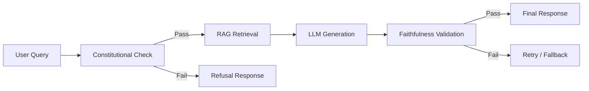

# JIHUN (지훈) — Constitutional Defense LLM

**JIHUN** is a locally-deployable language model with built-in constitutional safeguards, built for defense applications. Named after the Korean name meaning "Wisdom + Achievement," JIHUN is designed to protect critical infrastructure, analyze threats, and refuse harmful requests—all while running completely offline.

## 🛡️ What JIHUN Does

- **Constitutional AI**: Built-in refusal mechanisms for prohibited requests
- **RAG Pipeline**: Retrieves from defense manuals, threat databases, and doctrine
- **Adversarial Red Teaming**: Automated test suite that attacks its own safeguards
- **Offline Deployment**: No cloud calls—your data stays on your hardware
- **Observability**: Full metrics on latency, faithfulness, pass rates

## 🏗️ Architecture

## 🧠 Why JIHUN?

The name JIHUN (智勳) combines:
- **智 (Ji)** – Wisdom, intelligence, strategic depth
- **勳 (Hun)** – Achievement, merit, proven defense

Like its name, JIHUN is built to defend with wisdom and proven reliability.

## 🔧 Current Status

- [x] NanoGPT base implementation (in progress)
- [ ] Constitutional safeguards
- [ ] RAG pipeline with defense corpus
- [ ] Adversarial test suite
- [ ] Observability metrics

## 📊 Sample Use Cases

- Threat assessment from intelligence reports
- Vulnerability detection in code
- Refusal of prohibited requests
- Generation of structured defense formats
